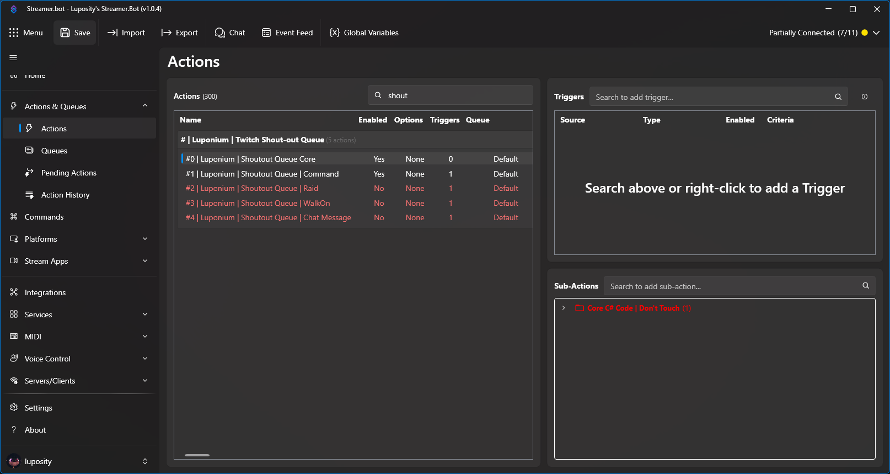
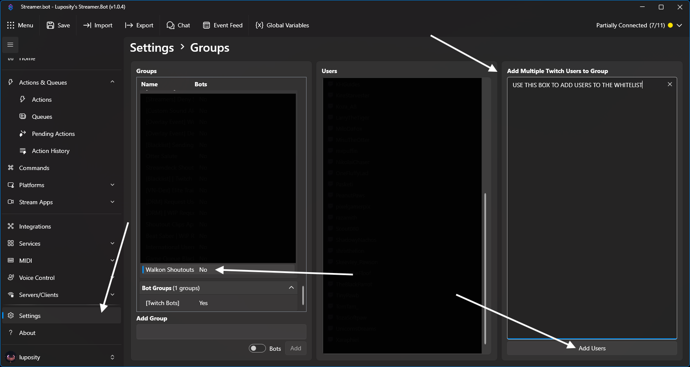
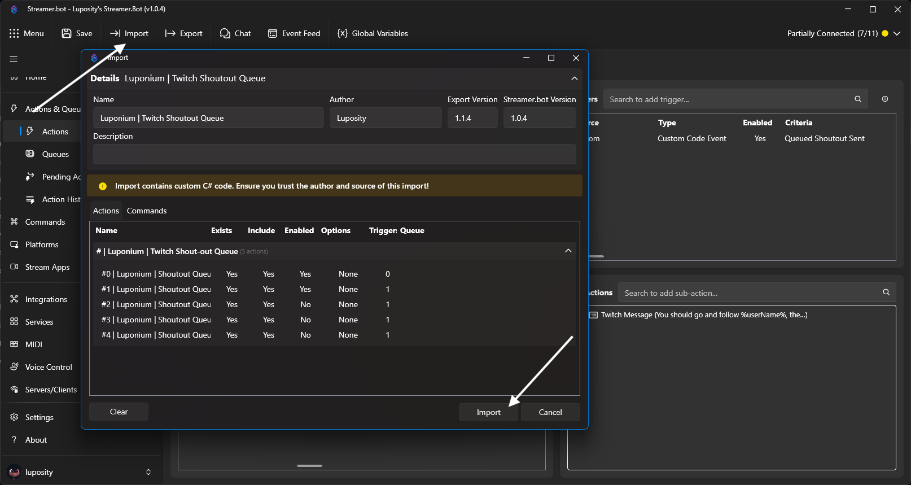

# <b>Luposity's Twitch Shoutout Queue</b>
A Twitch Shoutout Queue for Streamer.bot that simplifies and automates Twitch Shoutouts

Features:
- Auto Shoutouts for Raids
- Priority Based Queue
- Walk-on Shoutouts
- Mass Shoutouts
- Shared Chat Combined Shoutouts

> [!IMPORTANT]
> This was built using Streamer.bot v1.0.4, this will not work on any version before 1.0.0.

The Streamer.bot Import string for copy and pasting is found at the bottom, you can also download the _**TwitchShoutoutQueue.StreamerBot.Import**_ file and drag it into your Import tab.<br>

On importing the action, 3 actions will be disabled, enable them if you want to use them.


------

# <b>Set-up</b>

The setup is pretty much a drag and drop, you won't need to really change much but to enable the command or change it to your own custom one.

> [!IMPORTANT]
> If the shout-out queue seems to fail, there's a few reasons;
> - It will silently drop when trying to add yourself to the shoutout queue.
> - It will silently drop if adding your bot account to the shout-out queue.
> - It will silently drop if your not currently streaming.
> - A user was sent a shout-out in the past hour.
> - Twitch has a 1 hour cooldown between sending shoutouts per person.

## Command Setup
The command included has a few extra modifications to it, if you don't want something to function like i've set it up, then just change it.

- The command can be found in: `Commands -> Luponium | Shout-out Command`<br>
- The command has Shared Chat trigger enabled as well as chat command trigger.<br>
- Channel Moderators and VIPs have access to using the Shout-out command<br>

-----
### Sending Mass-Shoutouts
Sending mass-shoutouts is as easy as using the following message pattern after the command;<br>
- `!so @user1 @user2 @user3 @user4`
- `!so user1 user2 user3 user4`
> [!IMPORTANT]
> The Shoutout queue will most likely fail to add users with international display names, if your wanting to shout-out people with international display names you will have to use the user login

When you add people to the shout-out queue, your account (or your bot account) will respond with a reply;<br>
`Shoutout Queue updated, {usersAdded.Count} added, {queueCount} now in queue. (Added: {addedUsers})`

------
## <b>Raids Setup</b>
By default Raid shout-outs will be disabled, you can enable the module by turning on the action<br>
Once Raid shout-outs are enabled, they run in a higher priority than Command and Walk-on Shout-outs, this just means, any raid shout-out will run first if there's currently a queue.

Feel free to add your own logic in the action or leave it as default to trigger on all raids.

-----
## <b>Walk-on Setup</b>
When you import the shoutout queue, it will automatically create a Streamer.bot Group. This basically serves as a whitelist.
You will need to manually add people to the whitelist for it to start sending shout-outs for walk-ons.

You will need to Enable the action, by default it is disabled (shows up as red in actions)<br>
Right click on the action and check the Enabled checkbox.

The group can be found in Streamer.bot by going to the following;
- `Settings -> Groups -> Walkon Shoutouts`



------
## <b>Shoutout Chat Message</b>
By default, there will be no Chat Message when a shout-out is sent, it'll only Trigger the Twitch `/shoutout` command. If you want to send a chat message as well as the /shoutout, there's a custom trigger that get's added: <br>
- `Triggers -> Add -> Custom -> Luponium -> Twitch Shoutout Queue -> Queued Shoutout Sent`

I've add this as action `#4 | Luponium | Shoutout Queue | Chat Message` so you dont need to add it yourself.

I've specified a predefined chat message, but if you want to use your own and apply logic, you can use the following variables:


| Variable         | Value                                                   |
|------------------|---------------------------------------------------------|
|`event`           |`luponium_queuedShoutout`                                |
|`extensionVersion`|`1.1.4`                                                  |
|`queuePriority`   | `Default` or `Raid`                                     |
|`channelUrl`      |`https://www.twitch.tv/luposity`                         |
|`description`     | `channel description`                                     |
|`profileImageUrl` | `https://static-cdn.jtvnw.net/jtv_user_pictures/55ba05f0-f9d7-42df-b723-cc55dca2447f-profile_image-300x300.png`                                   |
|`userType`   | `affiliate`                                          |
|`isPartner`   | `false`                                     |
|`isAffiliate`   | `true`                                     |
|`isFollowing`   | `false`                                     |
|`createdAt`   | `05/17/2026 00:00:00`                                     |
|`accountAge`   | `286234160.972626`                                     |
|`game`   | `No Man's Sky`                                     |
|`gameId`   | `458781`                                     |
|`channelTitle`   | `Testing`                                     |
|`tags`   | `List<string>`                                     |
|`isSubscribed`   | `false`                                     |
|`SubscriptionTier`   | `null`                                     |
|`isModerator`   | `false`                                     |
|`isVip`   | `false`                                     |
|`userName`   | `Luposity`                                     |
|`userLogin`   | `luposity`                                     |
|`userId`   | `123456789`                                     |
|`lastActive`   | `05/17/2026 00:00:00`                                     |
|`previousActive`   | `05/17/2026 00:00:00`                                    |

-------

## Streamer.bot Import String

Copy the string below and paste it into your Streamer.bot Import tab

```
U0JBRR+LCAAAAAAABADtXelz4kiW/74R+z8wNdGxH6bl1QloImYjDDaXbaoAI471xIaUmQIVOhgkcXim//d9mTqQQMLYXd1dtbEVTRtQKvXu93svU+Kf//5vlconhwT6p79W/kk/wEdXdwh8/PQYrj3XCp3KvyrPOytAy8po6YUB/FcZhCQkn36OT9DDYOltklN8Kzikh7Zk41ueS48JN8KNnB7AxEcbax3EB7NzecPQvUXxETe07eSYY7mWEzpaOic9SI/9wkZ8wnqOD53N4cM3/x19U0kOscMWphfGhqBKil7n6mrd4GQk8pyqKIgzdEWuqYSoqG4mxLHT/sFYhzP5+B9X8L/kX+5M4uqGTehVg01Ickf2yA4xaW08p2P5gbc5wCBTt/2yUV+Iiy13UTQq0d6fedBbRoV53VWa3obkqFtsvHDNTsyfl1U9d6b7SND2Tj/4oLUieja6iz0n1efZceS5KNxsiBsUHQ021mIB+qZK/Hv2gB8at+f6PdFxTiCU40rzz8A5JsDXnef+R1B59kK0zDIT02RH9vznVutUjRmmCgh+g7YC+nI0RkQFlKhK6NrE9ysHL6ysXG9X2S31gH7aVLBHdf9zwTxvEf428VcwUMJEjpEuMGFjRrzrUY5ipoKl5d/c3BTRdTUD1zFxJSMXmMkxVOpJZRSys0uiXDFHxCTgBohcpJUNbf715WVigQB2/svLk4U2nu+ZwU3//vnlpbUBinfeZlWVX1628g1/I/GSoL68OD7yNrZl3GDbvkTIR+cfHfyAOL/x7NSJr7jEzctLn+wC0Dudued77nUnHamhUeLW1e2DDwZ71bkphbZNIpu76TpOGNCgf+UMwYYA+5sbw6MEOM5VZP8acfZJcNMJgvXvcJl3yr+B7Jtb/+CirhuQjamDW7xLDc9LkCXNkTfPur/yb+73AXF9ppV3UvLsefbKCm7Gu/VN3wss00J6cOVEv0ZokE8DyyE38fnJR3rR8mv+/VKEMQ4BoXbNcM+0vzYctBhL9itua8HnHf9w+t3jqr812nt7Jg3Xhqi8Pq6wbTjaQZ881e4GawGJdjg/NJ7JtM/PJ3w4EFXfaGtfcdveGu5TOJYa9ky0l0bbrs4ng8Jzhm17OReVLYJrzKTieUfjeuH3z207RM9+v+lqr/pEcbutvgLz2MZI+TyfDsJRZ8iju9LjhXOOHc1JefhaeO54Pl3yj3bPnkuaP5v2WqTTOMynfRinhui1+By907NnkyGVb6i1W696nlegB/NUxoY45x9Xa/grn/N3r9hYGoJs+9u5C/zBX0bjgn9AHc0COX/ttvtAU/+1e98fjO7tEL4L5wP+gYB+u83bRbfTEGbOfj0DnvW2KmD6arWE+VSzu52+Z0gaT19j+Iwn48WXUSOcT8EmxOUWT4f0NcQTTZiPFuvP53OO9Ylgg96XhtV4Tee/BzrF/cqQcNi94xda2w7mWn83m8jh0O1tjbGwNlyNn0+fvP7X2+y8B306X+L2eDFz1K3RbOyQo36NZK24GRqd2WT/OqeysuC8ZmMyn/aYPrptTQZbDkHOW8Oe28gFGxfllC8N7Jkdsxb7x+YtffEPx3l2eNLzwd4X2FHX82ajZzg2/9BcJcdBh96C0UpfVOZNZTSf4DXVO1r1BUT1pQ3BZ7A7n3a9rh3JGuY6yh/ezycK37V2i66zF1BbDfWpFkyleGzrqBc6ZnLoPeFpYwu0CMao63ebvTEWbX4mLjJ6Gixi+VjT0SpPZ9t2us3FciA0uuDTB5h3N5wuKc2vD83eFGS5oTLK6Py1a63WuTnYq3E3vl+Eg8lwNZR6MO4W+MPg7wHIM8Nf58nKyFSFec7kG+u3ZbgRz2OnBfJepNdM7TdzXa3TU4aixg+mPRfoBl/SDqPJwHpsNhj/wM+B+U1HewV76M2bqyJ9jZFrd+bTYQM5yOu6bOznGdgxlTWTeafPI4f5KbvGs9MK5oUyXTKejfbwWRftnTbt28haJnStHwZZHqIXcjQeT3tgp/Ol0enbn/N8irNpd4E6vbUh9da4s6J2OwBatvDiyUgZzSb26uSc11O/flyB/Ue24GFK08pegYwyvOyy11ifzLeeW6DXaeNgiHCuRHMEjmNA4geZV6sPOWKYse3F6XwQK4cCcuQF7vSE+TvtQhNbvi6q4Rs+WKRT0D/4SuRvr5jyC7kukcfRPqMX8w17eCBjbOP71mF+WFjRWGVpgE+V2Bizm9O59Mls8RD5sA++vNGnDY3K/uFol0W+lcpp7rR8JI7zfHbmS2TReJjYwq3abUG8nKgQM4fK42pow3mC0RmcnHcW48PhRNlH+kxt1c/y89jMXqc4loD9bGei9srymRDpqsjex6IWZuPZw6lPQp7EHe0A8YNHrnb0hw7P8txJvrEMwBzd+8S+tTtDFILZRFm9zz56S8xDru1E8fXE5w+zKe4ZbgPs5or44Qivc95eFc0znzZ8Mj63Ney0DrG8X2l+RE5LGk2UHdgXxSM7o936CvnWGlD7bXath5HyjNr7NW4uIYdhYzpq1LpNtOgdGiro6jmybRyNuVd3KR5ztMCQ5vZwIuxwxwaforarvdL55hOK8wYeBjv6YjUEavv6hPfg2Njg91tM7RXsFOyK5gmYv091B1hGfdKn/QI9ftQ+2XnMDhHfWs3b2orKBHCn1L3fw7UH9cTnvlhnscWBGAY4q+9BLGaxk/ms1VgbyZyHfMzK55VYH5BXCvyxdv7dmf4AH8y3lN44fkjA61f9nsaQCIdQfrQo5oRzR22S8X47B5+JYkH3hJ/MK8ovsX8qjnEAPQGGwZO9X+RnGbq/Aq7kQV6ZWHs25igriIWUfpzSWA9jeldv0Pbu3PdOGt+V1yIZKdp1OS7ziv2QYhqoWRi2ecjo9tEuj/NpnDr9rt0HDNv3rrMplgfz8y2K8vEpnYry8EYeyefbrO1G8oT6TTDcAcUYBbLubzFg1CJ8MmM0DLXIv8DP05inPBjUtqO45Z/IthBnMD26/ca8DfGhqdxBDA1x8/YvX0a3+25z5tCa4ByHNOpmMx8zEnq7d/LiaXTr9Kzbq3NUzndbPRviqAJxrk/rjtkE2w/NgVWAs8FnGqvZlNK9WxDpRD9MtkO1247pA92nOYvy2KExTpXAl8JEH48gj/j8arcTLJlMWtG85mhFMUiaU+A9y5fJ30IM0mwV1U9FNkPrkVWGR+90vhS3doYHmCO1YxPkmbyn/gb2xYN+lkiyQ8jXItjDqggjluB8ZhPX6i2h6cSuymrGPL6IxsJ3V+QHcbk2oCZ9KMBSqQ9Zt7siGovmy+S9kPYWRlPaM2B+dDb/uK3Z+uE072XnydcqEHtL/Bnq0zh2Qo7X4rGlOS7vEyf6u+8pcK5XhqUz8r2D2tIfgG/AeQHUb+u5iLN5AvC5YpPOsMf6T3YGL9jD7TjO+zTOlfIfYbJniHlxTbxkvGkQ5wauDVg7c61mj/ZK+IydU5+6pz7MehQj5bMhIT+pzS7wtcRiC/BYYwzzbahsAbMpD3f3r093t7unU2xUFuczc89Bh1RWJGdDhfniyp7IbeqfZ3kl02eJ+xxlejqrmx4ztVQ2v5b4cxZnUGxB6aTYmeXWE/2c5gd27rDd4mfUN8BO8KFxr0/6PO3zzKY95Utq+4C9xd4/5nDsy+JN+ZXafNfRxLgvU6L3W8voAD4XlTWeCGYcz7Nx0yrS++PtO+JCs0f9wTZY30o59rVKaWoUjv8GdHzV260QcLivTXv+BZmsus6Sx53G62ervsUSlh7dOG40FR5bau0cW0YY2Bx1i/CU/y6dJf2joy1aRXymdh/Hl7fl01DfqjVonkLNY60RY1Bq32Mybdi0XqL9qjEd19YOUJfZCGL5w9s+zubXRU2h2BxiGuSKY10G14HjvTXUvfwDxUfSbcgwr+bvpqPV4uHAYsTuMepdhGNJs5IaCmJUYSxlfqYFm/nUxqwmZbwxXiYQGzK9Asrjae13hlmTfl0URwCbAQZqYYdiu8WbPhTH5GVZDxF8XqQxu9vubQ1xF/UtJ3uYI1gjhpe6XkEvsKQ/MIQ4qLE+dre9B9ySxSkQd6L80inNL3f7Y/54ljN1CcSKdusVn/Ry497OaayL+hptleKJLdRUoGfWsz7NTYvHUeM0hy2+NIt770V4G+R+R681b6uSYRX088r6MZk50NnaAJ1T4WcTO0RCJP8UGxT1DK+4Rkmv2qCYYD4BW4c4NwX5QLxWujkZrxY9axbjl1j393aY9KszeWwA+uGhJj/Q9Zq4n04xwjXXeHfdxfB4aouslo99BK9prcj62i7g3snwK9UvlWEGp/0213PUqKeT9AFovRX3uGJbp3bfNKRBlpZF9xlqF1fzjea7dVva48zXEfHaVivBn8d6fDhdLCjtLA7xEQ5Nfb0N9pbinbw8Er4zvZgWobH73f0buEb7HPMe+/osz+X4inhbH3vcIo0zT+drbPl1uxSjwdxQC6qh0VnBOSrkEW01BPmwPh/EIfK8X0MN4if9sggTagxTf/kqL5J1JVarRzjqGXIZDzV8Hk8B7Rhq2ee2/Yrv9hFNY5uuk/4l13s79mOj+u7+2Jc5j7u7wp459b9jrzDXby6O04y2BuQnuiZy6+k0902P+bxwDUNToz739InG1RC3WyCn/iPM4dHcWhibWsk5fYOOmR6xJ+t7fonrKVazQbw/tYNU1kKUSx9XUP+zvi1aZPXykJFPZp3Bz2KUh0zvvdg/MrTQODWNa+WyXBfVnI4OcY3lttZRPpDPfHj/+riar5Hb55+lHsQ9sL/JHjDG/eLLs7xAo2N/pnt3W9jPgTrmADYI4y/FiKGHWO+DybVnuHO6Z2D1LDVs5LSYPULMhxqnwd5D3E/6Pmt0aNgGfE9GslXYV28ze2X1EOOzBZjoZFxMY9ofH0wH3lnNdoxj62S/xBnWOfpB1lcAS2mRXMc9JYmtD+d1elnNdIYzDeqPEc5M8NLro01rVOrTV/Qv8nLxqR0X63nB9Eyax1hP9Xixzo96wUxG3eY99RXBaO+K8lUpho/4o+vowhY7Y09n9lxUQ5/FWsrTR3qqaR5iNnp3eU0y67fdVsOeT3yvLM9Eso5kS/PKMfYqEY4GXxsy+xt+Qcc1EQ9F6zD7XB/z1CYjWaf+e2k94Cgjpo8y2y7wkYvrsrGOtHg982qbTuVdJA/Wy26z3EXt7/ux5zv+gj2fyrloPf+99n0Z05lv5YO4Hsrkum+qp7Go+bTH8jxphWS03IN8/tLt3K8hx9HPcvR5ccSTVH4FezGKaWf5Pckv1BcKYp3yjCf8ma8wPZauFduv0frnCjAsO+94jdHtrmjv0WgMxwGjQC4C2sb1h3yejXqVNB67g8W4rb6CPukeozXM3aY1BcWNGuBnvdXYIvp3cmH/wtEXC/mN1mmH/Rn1kTQPr1JdPMS2yuhxhjZprtiYh8g/fIZH25rcbfqLp1Gmj1qcxyhP/9ml+DdL+wfsZ+jsl5j2pWyKu5cDQ+qvGV4FHPloYw9sws74Z9z/zdUr6bUe7b7N9ug1YxsDnhmdTVt+tDN0jpQ2i2f36gFysDOban5uP0oxzxGuS3h8lVl9EcfoOG5A7RnZ59fIdr6tLrV2azMfLZO5j7o9j19r2hdn+PxtvtI+LVtD4KP4mOKR38oei2guis1vxYO4lonlnrGfXT4f3zM7p743mE+0zbMDdVvrxObcJ1YvdNtxvCjJ3Wksv5/7s+kQ5lWm4NtexsfZ/ojZJLAfkrkyeykIi1u38FfJ0ZvY98OoeP/EJf6zvA47wy3wSWvyGG+2XpmfRWNLMcmVfJ3w0TirWej1Ye5szKP5N+eDEIe0zDqU/Lhi+klzQnI8WqOna16LMIqr+bX7cX4PXDpP5nsqy3jvCwL6G2q8dyWSxRt4Jq1JW8Mt21drLeMeHIuXIY73oST9urfiHZuD7p926Z7TAfUHmL8F2GRtP8drEw8srsZr79M+yxWJLyfx23DpevItxOA51MMCjaFsD/Fooqzo2sQc5PqZ5hmpF1BdUh4eV8rWcMZvxYO4Vu+Dn7bo3h7mp5k8fwcxFurDKK6U9iwy9gDHa2d2e8wVqR2QQ8Ol+6+Pa15FesjswwQbm0MM/nw44vhjzXusj3Pv8+dcxPAF+cwv3vOZt8Mr1ruyti8UrrFm+Uz33bDa/2RchreoH59c+w0cpYowP5w7tDM8jQ0heV+69p7acq/ZM4gQ5+KOgLud4OibU97K2ZnLn+xHp9iJz8oNxqS+yPavUn6emsl6UiPNCez7S/2yk1hUaH9n+aJR67bB7+78BSqzqYs222fnHtdRz/OrdtThu87L2lbReebgb3+7eAvZekOQ56wtm5zfZHo2GBNbP4wCfRNcMdjXt2RI/NAOnj1N31j0pqY3br5Lz8udcfkeuOieXKWOZVXmTU7HhsLJdVnm9DoyOFGSCKkSLAqCeXGaHbEWS8oWf8NfGhcc1pQmlf67KFed3p/aZcRJCNVqhJc5YhDCyWa9yukIK5xoIB0D4XUe4YvEld4GfC4NF5M95aJszC/FB8puAorF+2s4uEa0GbHypWOyItV1FREZI64qVxEny7zIGRgTDtcFReFrssHjailBV4nzsigLxFgkwlh8H6X2LdG9JbacyLCqwJXqoDSxpoOL8AqnS0aNgxyDq7yk1ESl0EXeFle5qE7EdCqi5Ib6D1B2STSXxJIVSeZBAdcxW8xohsnc/ebIs2197RPcpvfJR/ejJ4d/SQeeP19AlQRTxVUFrKVeB2cjAojDFDkk8VUqJ9OUxB/z+QLCxecL/KtCb2DV3Vwk+QEeMnDpSQIo4ijywCpPsKHLOifyqsjJNVXndEPgOZNUsWnUsS7kFZuxCUE1aiIiBlfTVZ6Tqybh9BqqccjQRRMbqCaJ0tmpsRvIvPA+K2da9ZNb4P9+ja1f/2yFrW5HxnrPaKgES1KJpVSx3OxHv+JHd0VfeNhCnac3/ZcIrS6ZvGFC2K1LMmQtCfGcgfgax4tYN0ykE0n6UFwReP409/8WYeXnq8T4eVPZkLWtI1Kxggo4xTJ64oO3cyt+4mDo3LHeI0iDhwitIonTBcj8MsIQkaqqwhEFRMgLgiSL53P/kYIUrhdkEpzu9wSFAXvcxxMJlh7+3h74QSIC6d3Y3V+FeenDe4C/yAdZ7iiIu0c2QvezO7aim+MvPgHkfXj/HOcXqJsNjDGUYAoSweDCZlXgZEOSOFUWTQ5jAfOixIsy+bUYSq2/haGQSWS1XqtyigjoV5ZNIEcR6ly9WkM6L5h1g6A/BkN9hLI/FkOJH8RQ2dOuYzsz9zX4S+ENUahChq4aCgZL4yGBCDWZQ7qC6FMlVN6Uvzn+ugStvh0AE98AYEPd+r+EvhyLTs6dwR9H3xd+H2c7oiJdJwoAbl0C/Rt1TiWiyhmAukRZALBlqmVYS+Br3znWih5xVvEiqGUTkz1qSbdtb1ehT1KLQAPVqV8xPQAXYBL+R4FDTeZVWeDrHNQtBicrOlR2dR1DoUfgQxUqYfX7Ag7vQGD/DxxCchovjjx8J6hBMWt8TYEILlV1xMkYAnodVeucotdVuW4SVNP13xw1yJJJ6OXgqoQmKQLQpV43OUOoy7S/YYjnxVukud8aNXyEsj8WNeSR/QdRw1VsvxM11E1FxnUeQ7KnLVJVAPcSoWAX6kjBtSoG6PCjogbpDdQw0e3VZ/f/EG4IfbKJuS+yVMsfw4BuWVyLDaJaV0TJ0KFWqfEiGESdcDoxDa5a54mIoIY29dKWjSCeec8PDiN2YCMcvdYHkQQyTHAubHCGIVQBScg6BHJT4oii12qSXJUE8az8+1GQRCrfydIKiA1+W1kTbw2SThpikEUDgiuRV5VLkAcJtlolEpQkZNSJWONqpsFzsl5XONpU5HQZop0KaR8K6e9Kgu9o4qQSZAG/YlGbC11cgRfZ/LUyIkEAQc6vcP9ViVICfUfDFthvEs4umeZFwdZqdYKqVUAWogIYQ9cBTklgn9VaHSNAv6b+nYFc8XrBps8y9RYW+t6ALQ3TlDD2oNSf0k8/FWIp5jv9mJ23VB+Ji2mXVAUsAjzmZEGFatAUMLiNwHMKfFkjulxVzGLwdiWCVJQ38aMKKEUQqiIHEIMtCClc3ahVuSqCuFeV6kiUvz1+PBtdpAHLXYcBk77lMscqlr23Jhs9TtmFskj993lT/Hhc9pDv50hiZbx8/BHEv9eTgb9ZJZbOeFaRRZZ9+anBV9ZmR8a/1U6OklotPSEGTiYRsCBKnMSWyRTJ4OoS4GEJ85jXayrEVOVb7+Uo8sF0XG7jAUIyrkqAzkmdEgcaq5s1oNWQIPrXjKok1b/vvRy/hoP37uU47bClYy7nsXTYt9ipUXjWt4wEb8hbUUSeRwbhiFCFBKKaIqfqdagDBEU0TBnL1erZqm86xTvlLf6u8hYK5X3+5YWdMUgyzTrhCccrCsB6nphgjEaVQ1VDEgzMC4QUN5iuzK7nhdSpOH6P7HomqOu6Mx+h7I/tzkjfojvzfpu4TlIZcpK3lxo6VbNW04nK09yMOVlmS48m5nTFFBHGRJXzZPxADR35rX049Hcjnojv64sf7Rc/rilmGHH4yPaIzntm8Fv4NqkX7JjV/2E6xsmZZftOIJ1iEaucAubHySIPAKaKEccbIi+opiHUjPPiKAlYdf4siv+RvZ+A7BnAn3kha+nYuLLwKnSzjumxZg+ru6icfvqZ9ioOlR3ZkIqt+0HFJ8St+OwXCsAiKz8t6Ciwlp/QUnddYo839lm9QIu6hleyv/gTqN42dLQqC0OR44qQaHmowkVeMUH8WOLqKvwPUI9KBL0u1+TzbVZX1eO/Q6Po+ph5DGLRm2R8FIdyyCTZhlb6w0ZQnzlWEBBMG5vnv5yTHi6J2E9Q0ECB521OCulPWveL/6mEJetDe+JKf12FhZ2iDYQXgqvlsrB5rqBPTvSbB3xeB9HkcPE/+d7L5sX9k18QCD5tyILs7/dr20JW0NTXQbgpKpc+2R4qKoo/WQvX21AnuEXIC90CX4iHsN+5cHW7YIDvhZvoZ2GE2okmfUgjTTov2RRRFY+ghnBhFNJ9MqK/jhFY20LmFrZn6HbT82zs7SiLSvZoyGZPj+XYz+SYjI6biQXnh+puEHcF+DJ32BHD99CKBCOy2Z5Y9/Fg07bAlfMH6Y9nbI6+Fv9k2PH3yUQp+obs194GvIOm30/sZ8v45GfLzn+AjB0FUGGvl/qNAM7xy/8CtqOW/1JtAAA=
```

------
> [!NOTE]
> ### AI Content Disclaimer<br>
> AI tools were used in the production of this Extension. The use of AI tools were used for educational purposes only and does not reflect my final expertise and expereince.
> I am fully self taught with C# scripting and use online tools to assist myself with educating myself.
> Sources I've used for teaching myself include:
> - Microsoft Learn
> - W3Schools
> - YouTube
> - Stackoverflow
